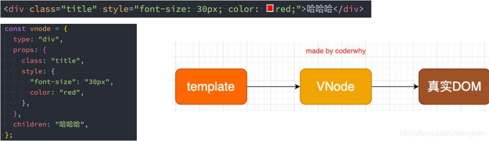
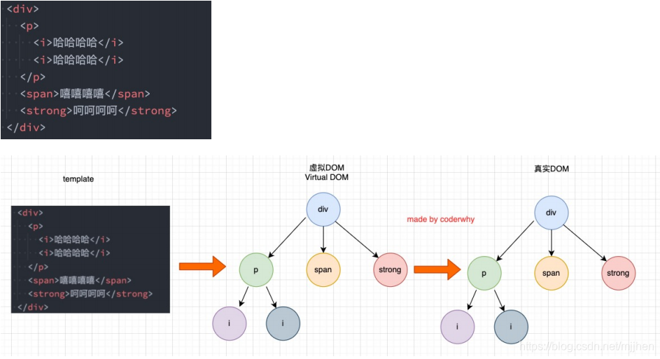
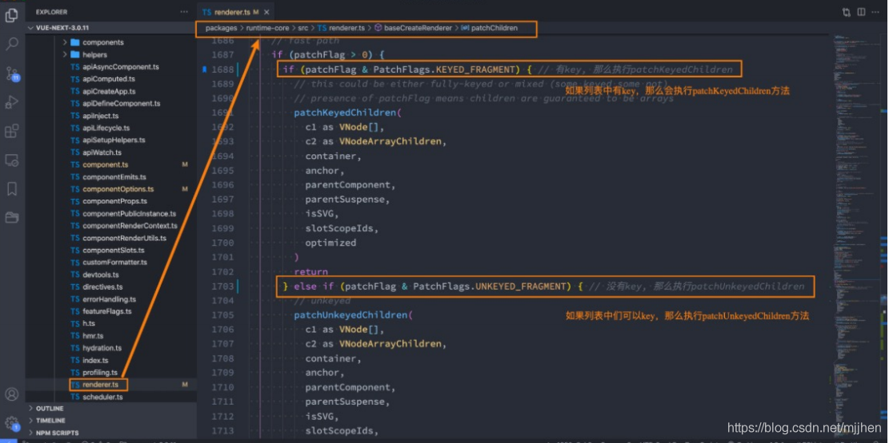
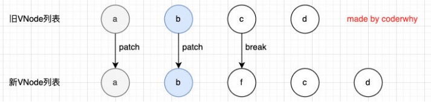
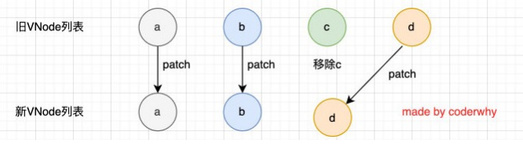
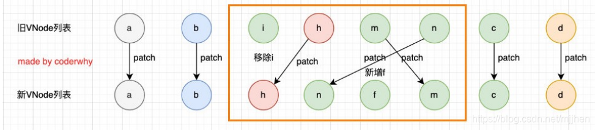

#  深入Vue3+TypeScropt技术栈

## 邂逅Vue3开发

### 认识Vue

- vue同view

- 渐进式：把vue作为你应用的一部分嵌入其总

- 目前Vue在前端处在什么地位？

  - 目前前端最主流的三大框架：Vue、React、Angular

    


### 如何引入Vue

1. CDN引入

   - CDN 称之为内容分发网络( Content Delivery Network或 Content Distribution Network,缩写:CDN)

     - 它是指通过相互连接的网络系统,利用最靠近每个用户的服务器;
     - 更快、更可靠地将音乐、图片、视频、应用程序及其他文件发送给用户;
     - 来提供高性能、可扩展性及低成本的网络内容传递给用户;

   - 代码：

     ```html
     <body>
       <div id="app"></div>
     
       <script src="https://unpkg.com/vue@next"></script>
       <script>
         const mjjh = {
           template: '<h2>Hellow World</h2>'
         }
         const app = Vue.createApp(mjjh);
         app.mount("#app")
       </script>
     </body>
     ```

2. local引入

   - 下载后直接引入

   - 代码：

     ```html
     <body>
       <div id="app"></div>
     
       <script src="../js//Vue.js"></script>
       <script>
         const app = Vue.createApp({
           template: '<h2>Hellow World</h2>'
         }).mount("#app")
       </script>
     </body>
     ```

### Vue初识-计数器案例

- js原生

  ```html
  <body>
    <h2 class="counter"></h2>
    <button class="increment">+1</button>
    <button class="decrement">-1</button>
    <script>
      const conterEl = document.querySelector('.counter')
      const incrementEl = document.querySelector('.increment')
      const decrementEl = document.querySelector('.decrement')
  
      let counter = 100;
      conterEl.innerHTML = counter;
  
      incrementEl.addEventListener("click",() =>{
        counter += 1;
        conterEl.innerHTML = counter
      })
      decrementEl.addEventListener("click",() =>{
        counter -= 1;
        conterEl.innerHTML = counter
      })
  
    </script>
  </body>
  ```

- Vue

  ```html
  <body>
    <div id="app"></div>
    <script src="../js//Vue.js"></script>
    <script>
      Vue.createApp({
        template: `
        <div>
          <h2>{{message}}</h2>
          <h2>{{counter}}</h2>
          <button @click='increment'>+1</button>
          <button @click='decrement'>-1</button>
        </div>
        `,
        data: function(){
          return{
            message:"Hello World",
            counter: 100
          }
        },
        methods: {
          increment(){
            this.counter++
          },
          decrement(){
            this.counter--
          }
        }
      }).mount("#app")
    </script>
  </body>
  ```

### 声明式编程和命令式编程

- 原生开发和Vue开发的模式和特点,我们会发现是完全不同的,这里其实涉及到两种不同的编程范式命令式编程和声明式编程
- 命令式编程关注的是“ how to do”,声明式编程关注的是" what to do",由框架(机器)完成"how"的过程

### MVVM模型

- MVC和MVVM都是一种软件的体系结构
  - MVC是 Model-View-Controller的简称,是在前期被使用非常框架的架构模式,比如iS、前端
  - MVVM是 Model-View- ViewMode的简称,是目前非常流行的架构模式
- 通常情况下,我们也经常称vue是一个MWVM的框架

vue官方其实有说明,ue虽然并没有完全遵守MVVM的模型,但是整个设计是受到它的启发的


### template属性

- 在使用 createApp的时候,我们传入了一个对象,接下来我们详细解析一下之前传入的属性分别代表什么含义。

- template属性:表示的是Vue需要帮助我们渲染的模板信息

  - 目前我们看到它里面有很多的HTML标签,这些标签会替换掉我们挂载到的元素(比如id为app的dⅳv)的innerHTML
  - 模板中有一些奇怪的语法,比如{},比如@ )click,这些都是模板特有的语法,我们会在后面讲到

- 但是这个模板的写法有点过于别扭了,并且IDE很有可能没有任何提示,阻碍我们编程的效率

- vue提供了两种方式:

  - 方式一:使用 script标签,并且标记它的类型为 X-template;

    ```html
    <body>
      <div id="app">hhhh</div>
    
      <script type="x-template" id="why">
        <div>
          <h2>{{message}}</h2>
          <h2>{{counter}}</h2>
          <button @click='increment'>+1</button>
          <button @click='decrement'>-1</button>
        </div>
      </script>
    
      <script src="../js//Vue.js"></script>
      <script>
        Vue.createApp({
          template: '#why',
          data: function(){
            return{
              message:"Hello World",
              counter: 100
            }
          },
          methods: {
            increment(){
              this.counter++
            },
            decrement(){
              this.counter--
            }
          }
        }).mount("#app")
      </script>
    </body>
    ```

  - 方式二:使用任意标签(通常使用 template标签,因为不会被浏览器渲染),设置id;v template元素是一种用于保存客户端内容的机制,该内容再加载页面时不会被呈现,但随后可以在运行时使用 JavaScript实例化

    ```html
    <body>
      <div id="app"></div>
      <template id="why">
        <div>
          <h2>{{message}}</h2>
          <h2>{{counter}}</h2>
          <button @click='increment'>+1</button>
          <button @click='decrement'>-1</button>
        </div>
      </template>
    
      <script src="../js//Vue.js"></script>
      <script>
        Vue.createApp({
          template: '#why',
          data: function(){
            return{
              message:"Hello World",
              counter: 100
            }
          },
          methods: {
            increment(){
              this.counter++
            },
            decrement(){
              this.counter--
            }
          }
        }).mount("#app")
      </script>
    </body>
    ```

    - 没用的小知识：也可使用div等盒子，但是div会被浏览器加载，所以会显示两个

### data属性

- data属性是传入一个函数,并且该函数需要返回一个对象
  - 在Vue2x的时候,也可以传入一个对象(虽然官方推荐是一个函数);
  - **在Vue3x的时候,必须传入一个函数,否则就会直接在浏览器中报错**
- data中返回的对象会被vue的响应式系统劫持,之后对该对象的修改或者访问都会在劫持中被处理
  - 所以我们在 template中通过{ counter}访问 counter,可以从对象中获取到数据
  - 所以我们修改 counter的值时, template中的{ counter)也会发生改变;

### methods属性（重点）

- methods属性是一个对象,通常我们会在这个对象中定义很多的方法

  - 这些方法可以被绑定到 template模板中;
  - 在该方法中,我们可以使用this关键字来直接访问到data中返回的对象的属性;

- 问题：官方文档有这个描述，即不能使用箭头函数

  

- **为什么不能使用箭头函数(VUE3.0)？**

  - 我们在methods中要使用data返回对象中的数据：
    - 那么这个this是必须有值的，并且应该可以通过this获取到data返回对象中的数据。
  - 那么我们这个this能不能是window呢？
    - 不可以是window，因为window中我们无法获取到data返回对象中的数据；
    - 但是如果我们使用箭头函数，那么这个this就会是window了；
  - 为什么是window呢？
    - 这里涉及到箭头函数使用this的查找规则，它会在自己的上层作用于中来查找this；
    - 最终刚好找到的是script作用于中的this，所以就是window；
  - this到底是如何查找和绑定的呢？
    - https://mp.weixin.qq.com/s/hYm0JgBI25grNG_2sCRlTA

- **不使用箭头函数的情况下，this到底指向什么**

  - 事实上Vue的源码当中就是对methods中的所有函数进行了遍历，并且通过bind绑定了this

    

### 如何阅读Vue源码

- 需要的环境 npm，yarn
- 操作步骤
  1. 安装yarn npm install yarn -g
  2. 在项目中配置yarn yarn install
  3. 在package.json中的dev后加上--sourcemap
  4. 打包项目 yarn dev （在vue/dist文件夹下有两个文件，vue.global.js和vue.global.js.map）
  5. 在vue/examplex新建自己的文件夹以及测试demo
  6. 在demo中打下断点—**debugger**
  7. 在浏览器中打开调试面板，选择其中的source面板，查看执行对应的源码

##  Vue基础-模板语法

### vs-code代码片段

- 设置-用户代码片段-选择语言
- 将需要的代码片段拷贝到https://snippet-generator.app网站下，并且填写完Description，和Tab trigger后，拷贝到vs-code即可

### 模板语法

- React的开发模式
  - React使用的jsx,所以对应的代码都是编写的类似于js的一种语法
  - 之后通过Babe将js编译成 React. create Element函数调用
- vue也支持jsx的开发模式(后续有时间也会讲到):
  - 但是大多数情况下,使用基于HTML的模板语法
  - 在模板中,允许开发者以声明式的方式将DOM和底层组件实例的数据绑定在-起;口在底层的实现中,vue将模板编译成虚拟DOM渲染函数,这个我会在后续给大家讲到;

### mustache的使用

- 基本使用

  ```html
  <h2>{{message}}</h2>
  ```

- 表达式

  ```html
  <h2>{{message*10}}</h2>
  ```

- 函数

  ```html
  <h2>{{message.split(" ").reverse()join(" ")}}</h2>
  ```

- 三元运算符

  ```html
  <h2>{{isShow ? "hhhh":""}}</h2>
  ```

### 不常用指令

- v-once指令

  - v-once用于指定元素或者组件只渲染一次

    - 当数据发生变化时,元素或者组件以及其所有的子元素将视为静态内容并且跳过;

    - 该指令可以用于性能优化;

      ```html
      <h2 v-once>{{counter}}</h2>
      <button @click="increment">+1</button>
      ```

  - 如果是子节点的化，也只能渲染一次

    ```html
    <div v-once>
        <h2>{{counter}}</h2>
        <h2>{{message}}</h2>
    </div>
    <button @click="increment">+1</button>
    ```

- v-text

  - 用于更新元素的 textContent

    ```html
    <h2 v-text="message"></h2>
    <!-- 等价于 -->
    <h2>{{message}}</h2>
    ```

- v-html

  - 默认情况下，如果我们展示的内容本身是 html 的，那么vue并不会对其进行特殊的解析。

    - 如果我们希望这个内容被Vue可以解析出来，那么可以使用 v-html 来展示

      ```html
      <template id="my-app">
          <div>{{msg}}</div>
          <div v-html="msg"></div>
      </template>
      
      <script>
          const App = {
              template: '#my-app',
              data() {
                  return {
                      msg: '<span style="color:red; background: blue;">哈哈哈</span>'
                  }
              }
          }
      </script>
      ```

- v-pre

  - v-pre用于跳过元素和它的子元素的编译过程，显示原始的Mustache标签：

    - 跳过不需要编译的节点，加快编译的速度

      ```html
      <template id="my-app">
          <h2 v-pre>{{message}}</h2>
      </template>
      ```

- v-cloak

  - 这个指令保持在元素上直到关联组件实例结束编译。

    - 和 CSS 规则如 [v-cloak] { display: none } 一起用时，这个指令可以隐藏未编译的 Mustache 标签直到组件实例准备完毕

      ```html
      <template id="my-app">
          <h2 v-cloak>{{message}}</h2>
      </template>
      
      <script>
          const App = {
            template: '#my-app',
            data() {
              return {
                message: "Hello World"
              }
            }
          }
      </script>
      ```

    - 不会显示，直到编译结束

### v-bind

- v-bind的绑定属性

  - 有用的小知识Vue3支持多个根元素
  - 前端讲的一系列指令，主要是将值插入到模板内容中。
  - 但是，除了内容需要动态来决定外，某些属性我们也希望动态来绑定。
    - 比如动态绑定a元素的href属性；
    - 比如动态绑定img元素的src属性；
  - 绑定属性我们使用v-bind：
  - 缩写：:
  - 预期：any (with argument) | Object (without argument)
  - 参数：attrOrProp (optional)
  - 修饰符：
    - .camel - 将 kebab-case attribute 名转换为 camelCase。
  - 用法：动态地绑定一个或多个 attribute，或一个组件 prop 到表达式。

- v-bind绑定基本属性

  - v-bind用于绑定一个或多个属性值，或者向另一个组件传递props值（这个学到组件时再介绍）；

  - 在开发中，有哪些属性需要动态进行绑定呢？

    - 还是有很多的，比如图片的链接src、网站的链接href、动态绑定一些类、样式等等

  - v-bind有一个对应的语法糖（:），也就是简写方式。

  - 在开发中，我们通常会使用语法糖的形式，因 为这样更加简洁

    ```html
    <template id="my-app">
        <!-- 1.v-bind的基本使用 -->
        
        <a v-bind:href="link">百度一下</a>
    
        <!-- 2.v-bind提供一个语法糖 : -->
        
        
    </template>
    ```

- v-bind绑定class

  - 在开发中,有时候我们的元素 class也是动态的,比如
    - 当数据为某个状态时,字体显示红色。
    - 当数据另一个状态时,字体显示黑色
  - 绑定class有两种方式：
    - 对象语法
    - 数组语法

- 绑定class-对象语法

  - 对象语法：我们可以传给 :class (v-bind:class 的简写) 一个对象，以动态地切换 class

    ```html
        <template id="my-app">
          <div :class="className">哈哈哈哈</div>
          <!-- 对象语法: {'active': boolean} -->
          <div :class="{'active': isActive}">呵呵呵呵</div>
          <button @click="toggle">切换</button>
    
          <!-- 也可以有多个键值对 -->
          <div :class="{active: isActive, title: true}">呵呵呵呵</div>
    
          <!-- 默认的class和动态的class结合 -->
          <div class="abc cba" :class="{active: isActive, title: true}">
            呵呵呵呵
          </div>
    
          <!-- 将对象放到一个单独的属性中 -->
          <div class="abc cba" :class="classObj">呵呵呵呵</div>
    
          <!-- 将返回的对象放到一个methods(computed)方法中 -->
          <div class="abc cba" :class="getClassObj()">呵呵呵呵</div>      
        </template>
    
        <script src="../js/vue.js"></script>
        <script>
          const App = {
            template: "#my-app",
            data() {
              return {
                className: "why",
                isActive: true,
                title: "abc",
                classObj: { 
                  active: true, 
                  title: true 
                },
              };
            },
            methods: {
              toggle() {
                this.isActive = !this.isActive;
              },
              getClassObj() {
                return { 
                  active: true, 
                  title: true 
                }
              }
            },
          };
    
          Vue.createApp(App).mount("#app");
        </script>
    ```

- 绑定class – 数组语法

  - 数组语法：我们可以把一个数组传给 :class，以应用一个 class 列表

    ```html
      <template id="my-app">
        <div :class="['abc', title]">哈哈哈哈</div>
        <div :class="['abc', title, isActive ? 'active': '']">哈哈哈哈</div>
        <div :class="['abc', title, {active: isActive}]">哈哈哈哈</div>
      </template>
    
      <script src="../js/vue.js"></script>
      <script>
        const App = {
          template: '#my-app',
          data() {
            return {
              message: "Hello World",
              title: "cba",
              isActive: true
            }
          }
        }
    
        Vue.createApp(App).mount('#app');
      </script>
    ```

- 绑定style介绍

  - 我们可以利用v-bind:style来绑定一些CSS内联样式
    - 这次因为某些样式我们需要根据数据动态来决定
    - 比如某段文字的颜色，大小等等
  - CSS property 名可以用驼峰式 (camelCase) 或短横线分隔 (kebab-case，记得用引号括起来) 来命名
  - 绑定class有两种方式
    - 对象语法
    - 数组语法

- 绑定style演练

  - 对象语法

    ```html
    <template id="my-app">
        <!-- :style="{cssPropertyName: cssPropertyValue}" -->
        <div :style="{color: finalColor, 'font-size': '30px'}">哈哈哈哈</div>
        <div :style="{color: finalColor, fontSize: '30px'}">哈哈哈哈</div>
        <div :style="{color: finalColor, fontSize: finalFontSize + 'px'}">哈哈哈哈</div>
    
        <!-- 绑定一个data中的属性值, 并且是一个对象 -->
        <div :style="finalStyleObj">呵呵呵呵</div>
        <!-- 调用一个方法 -->
        <div :style="getFinalStyleObj()">呵呵呵呵</div>
    </template>
    ```

  - 数组语法

    - style 的数组语法可以将多个样式对象应用到同一个元素上

      ```html
      <template id="my-app">
          <div :style="[style1Obj, style2Obj]">哈哈哈</div>
          
          <a :href=""></a>
          <div :class></div>
      </template>
      ```

- 动态绑定属性

  - 在某些情况下，我们属性的名称可能也不是固定的

    - 前端我们无论绑定src、href、class、style，属性名称都是固定的

    - 如果属性名称不是固定的，我们可以使用 :[属性名]=“值” 的格式来定义

    - 这种绑定的方式，我们称之为动态绑定属性；

      ```html
      <template id="my-app">
          <div :[name]="value">哈哈哈</div>
      </template>
      ```

- 绑定一个对象

  - 如果我们希望将一个对象的所有属性，绑定到元素上的所有属性，应该怎么做呢？

    - 非常简单，我们可以直接使用 v-bind 绑定一个 对象

  - 案例：info对象会被拆解成div的各个属性

    ```html
    <template id="my-app">
        <div v-bind="info">哈哈哈哈</div>
        <div :="info">哈哈哈哈</div>
    </template>
    ```

### v-on

- v-on绑定事件

  - 前面我们绑定了元素的内容和属性，在前端开发中另外一个非常重要的特性就是交互。
  - 在前端开发中，我们需要经常和用户进行各种各样的交互
    - 这个时候，我们就必须监听用户发生的事件，比如点击、拖拽、键盘事件等等
    - 在Vue中如何监听事件呢？使用v-on指令。

- v-on的用法

  - 缩写：@
  - 预期：Function | Inline Statement | Object
  - 参数：event p 修饰符：
    - .stop - 调用 event.stopPropagation()。
    - .prevent - 调用 event.preventDefault()。
    - .capture - 添加事件侦听器时使用 capture 模式。
    - .self - 只当事件是从侦听器绑定的元素本身触发时才触发回调。
    - .{keyAlias} - 仅当事件是从特定键触发时才触发回调。
    - .once - 只触发一次回调。
    - .left - 只当点击鼠标左键时触发。
    - .right - 只当点击鼠标右键时触发。
    - .middle - 只当点击鼠标中键时触发。
    - .passive - { passive: true } 模式添加侦听器
  - 用法：绑定事件监听

- v-on的基本使用

  ```html
  <template id="my-app">
      <!-- 完整写法: v-on:监听的事件="methods中方法" -->
      <button v-on:click="btn1Click">按钮1</button>
      <div class="area" v-on:mousemove="mouseMove">div</div>
      <!-- 语法糖 -->
      <button @click="btn1Click">按钮1</button>
      <!-- 绑定一个表达式: inline statement -->
      <button @click="counter++">{{counter}}</button>
      <!-- 绑定一个对象 -->
      <div class="area" v-on="{click: btn1Click, mousemove: mouseMove}"></div>
      <div class="area" @="{click: btn1Click, mousemove: mouseMove}"></div>
  </template>
  ```

- v-on参数传递

  - 当通过methods中定义方法，以供@click调用时，需要注意参数问题：

  - 情况一：如果该方法不需要额外参数，那么方法后的()可以不添加。

    - 但是注意：如果方法本身中有一个参数，那么会默认将原生事件event参数传递进去

  - 情况二：如果需要同时传入某个参数，同时需要event时，可以通过$event传入事件。

    ```html
    <template id="my-app">
        <!-- 默认传入event对象, 可以在方法中获取 -->
        <button @click="btn1Click">按钮1</button>
        <!-- $event可以获取到事件发生时的事件对象 -->
        <button @click="btn2Click($event, 'coderwhy', 18)">按钮2</button>
    </template>
    ```

- v-on的修饰符

  - v-on支持修饰符，修饰符相当于对事件进行了一些特殊的处理：

  - .stop - 调用 event.stopPropagation()。

  - .prevent - 调用 event.preventDefault()。

  - .capture - 添加事件侦听器时使用 capture 模式。

  - .self - 只当事件是从侦听器绑定的元素本身触发时才触发回调。

  - .{keyAlias} - 仅当事件是从特定键触发时才触发回调。

  - .once - 只触发一次回调。

  - .left - 只当点击鼠标左键时触发。

  - .right - 只当点击鼠标右键时触发。

  - .middle - 只当点击鼠标中键时触发。

  - .passive - { passive: true } 模式添加侦听器

    ```html
    <template id="my-app">
        <div @click="divClick">
        	<button @click.stop="btnClick">按钮</button>	
        </div>
        <input type="text" @keyup.enter="enterKeyup">
    </template>
    ```

### 条件渲染

- 在某些情况下，我们需要根据当前的条件决定某些元素或组件是否渲染，这个时候我们就需要进行条件判断了。

  - Vue提供了下面的指令来进行条件判断：
    - v-if
    - v-else
    - v-else-if
    - v-show

- v-if、v-else、v-else-if用于根据条件来渲染某一块的内容：

  - 这些内容只有在条件为true时，才会被渲染出来；

  - 这三个指令与JavaScript的条件语句if、else、else if类似；

    ```html
    <template id="my-app">
        <input type="text" v-model="score">
        <h2 v-if="score > 90">优秀</h2>
        <h2 v-else-if="score > 60">良好</h2>
        <h2 v-else>不及格</h2>
    </template>
    ```

- v-if的渲染原理：

  - v-if是惰性的；
  - 当条件为false时，其判断的内容完全不会被渲染或者会被销毁掉；
  - 当条件为true时，才会真正渲染条件块中的内容;

- template元素

  - 因为v-if是一个指令，所以必须将其添加到一个元素上：

    - 但是如果我们希望切换的是多个元素呢？
    - 此时我们渲染div，但是我们并不希望div这种元素被渲染； p
    - 这个时候，我们可以选择使用template；

  - template元素可以当做不可见的包裹元素，并且在v-if上使用，但是最终template不会被渲染出来：

    - 有点类似于小程序中的block

      ```html
      <template id="my-app">
          <template v-if="isShowHa">
              <h2>哈哈哈哈</h2>
              <h2>哈哈哈哈</h2>
              <h2>哈哈哈哈</h2>
          </template>
      
          <template v-else>
              <h2>呵呵呵呵</h2>
              <h2>呵呵呵呵</h2>
              <h2>呵呵呵呵</h2>
          </template>
      </template>
      ```

  - v-show

    - v-show和v-if的用法看起来是一致的，也是根据一个条件决定是否显示元素或者组件

      ```html
      <template id="my-app">
          <h2 v-show="isShow">哈哈哈哈</h2>
      </template>
      ```

  - v-show和v-if的区别

    - 首先，在用法上的区别：
      - v-show是不支持template；
      - v-show不可以和v-else一起使用；
    - 其次，本质的区别：
      - v-show元素无论是否需要显示到浏览器上，它的DOM实际都是有渲染的，只是通过CSS的display属性来进行 切换；
      - v-if当条件为false时，其对应的元素压根不会被渲染到DOM中；
    - 开发中如何进行选择呢？
      - 如果我们的元素需要在显示和隐藏之间频繁的切换，那么使用v-show；
      - 如果不会频繁的发生切换，那么使用v-if；

### 列表渲染

- 在真实开发中，我们往往会从服务器拿到一组数据，并且需要对其进行渲染。

  - 这个时候我们可以使用v-for来完成；
  - v-for类似于JavaScript的for循环，可以用于遍历一组数据；

- v-for基本使用

  - n v-for的基本格式是 "item in 数组"：

    - 数组通常是来自data或者prop，也可以是其他方式；
    - item是我们给每项元素起的一个别名，这个别名可以自定来定义；

  - 我们知道，在遍历一个数组的时候会经常需要拿到数组的索引：

    - 如果我们需要索引，可以使用格式： "(item, index) in 数组"；

    - 注意上面的顺序：数组元素项item是在前面的，索引项index是在后面的；

      ```html
      <template id="my-app">
          <h2>电影列表</h2>
          <ul>
            <!-- 遍历数组 -->
            <li v-for="(movie, index) in movies">{{index+1}}.{{movie}}</li>
          </ul>
          <h2>个人信息</h2>
          <ul>
            <!-- 遍历对象 -->
            <li v-for="(value, key, index) in info">{{value}}-{{key}}-{{index}}</li>
          </ul>
          <h2>遍历数字</h2>
          <ul>
            <li v-for="(num, index) in 10">{{num}}-{{index}}</li>
          </ul>
        </template>
      ```

- v-for支持的类型

  - v-for也支持遍历对象，并且支持有一二三个参数：
    - 一个参数： "value in object";
    - 二个参数： "(value, key) in object";
    - 三个参数： "(value, key, index) in object";
  - v-for同时也支持数字的遍历：
    - 每一个item都是一个数字；

- template元素

  - 类似于v-if，你可以使用 template 元素来循环渲染一段包含多个元素的内容：

    - 我们使用template来对多个元素进行包裹，而不是使用div来完成；

      ```html
      <template id="my-app">
          <ul>
            <template v-for="(value, key) in info">
              <li>{{key}}</li>
              <li>{{value}}</li>
              <li class="divider"></li>
            </template>
          </ul>
        </template>
      ```

- 数组更新检测

  - Vue 将被侦听的数组的变更方法进行了包裹，所以它们也将会触发视图更新。这些被包裹过的方法包括：

    - push()
    - pop()
    - shift()
    - unshift()
    - splice()
    - sort()
    - reverse()

  - 替换数组的方法

    - 上面的方法会直接修改原来的数组，但是某些方法不会替换原来的数组，而是会生成新的数组，比如 filter()、 concat() 和 slice()。

      ```html
       <template id="my-app">
          <h2>电影列表</h2>
          <ul>
            <li v-for="(movie, index) in movies">{{index+1}}.{{movie}}</li>
          </ul>
          <input type="text" v-model="newMovie">
          <button @click="addMovie">添加电影</button>
        </template>
      
        <script src="../js/vue.js"></script>
        <script>
          const App = {
            template: '#my-app',
            data() {
              return {
                newMovie: "",
                movies: [
                  "星际穿越",
                  "盗梦空间",
                  "大话西游",
                  "教父",
                  "少年派"
                ]
              }
            },
            methods: {
              addMovie() {
                this.movies.push(this.newMovie);
                this.newMovie = "";
      
                // this.movies = this.movies.filter(item => item.length > 2);
              }
            }
          }
      
          Vue.createApp(App).mount('#app');
        </script>
      ```

- v-for中的key是什么作用？

  - 在使用v-for进行列表渲染时，我们通常会给元素或者组件绑定一个key属性。
  - 这个key属性有什么作用呢？我们先来看一下官方的解释：
    - key属性主要用在Vue的虚拟DOM算法，在新旧nodes对比时辨识VNodes；
    - 如果不使用key，Vue会使用一种最大限度减少动态元素并且尽可能的尝试就地修改/复用相同类型元素的算法；
    - 而使用key时，它会基于key的变化重新排列元素顺序，并且会移除/销毁key不存在的元素；
  - 官方的解释对于初学者来说并不好理解，比如下面的问题：
    - 什么是新旧nodes，什么是VNode？
    - 没有key的时候，如何尝试修改和复用的？
    - 有key的时候，如何基于key重新排列的？

- 认识VNode

  - 我们先来解释一下VNode的概念：

    - 因为目前我们还没有比较完整的学习组件的概念，所以目前我们先理解HTML元素创建出来的VNode；
    - VNode的全称是Virtual Node，也就是虚拟节点；
    - 事实上，无论是组件还是元素，它们最终在Vue中表示出来的都是一个个VNode；
    - VNode的本质是一个JavaScript的对象；

    

- 虚拟DOM

  - 如果我们不只是一个简单的div，而是有一大堆的元素，那么它们应该会形成一个VNode Tree：

    

- 插入F的案例

  - 我们先来看一个案例：这个案例是当我点击按钮时会在中间插入一个f；

  - 我们可以确定的是，这次更新对于ul和button是不需要进行更新，需 要更新的是我们li的列表：

    - 在Vue中，对于相同父元素的子元素节点并不会重新渲染整个列 表；
    - 因为对于列表中 a、b、c、d它们都是没有变化的；
    - 在操作真实DOM的时候，我们只需要在中间插入一个f的li即可；

  - 那么Vue中对于列表的更新究竟是如何操作的呢？

    - Vue事实上会对于有key和没有key会调用两个不同的方法；

    - 有key，那么就使用 patchKeyedChildren方法；

    - 没有key，那么久使用 patchUnkeyedChildren方法；

      ```html
        <template id="my-app">
          <ul>
            <li v-for="item in letters" :key="item">{{item}}</li>
          </ul>
          <button @click="insertF">插入F元素</button>
        </template>
      
        <script src="../js/vue.js"></script>
        <script>
          const App = {
            template: '#my-app',
            data() {
              return {
                letters: ['a', 'b', 'c', 'd']
              }
            },
            methods: {
              insertF() {
                this.letters.splice(2, 0, 'f')
              }
            }
          }
      
          Vue.createApp(App).mount('#app');
        </script>
      ```

- Vue源码对于key的判断

  

- 没有key的操作

  

  - 没有key的操作过程

    - 我们会发现上面的diff算法效率并不高：

      - c和d来说它们事实上并不需要有任何的改动；

      - 但是因为我们的c被f所使用了，所有后续所有的内容都要一次进行改动，并且最后进行新增；

        

- 有key执行操作

  

  - 有key的操作过程-diff算法

    - 第一步的操作是从头开始进行遍历、比较：

      - a和b是一致的会继续进行比较；

      - c和f因为key不一致，所以就会break跳出循环；

        

    - 第二步的操作是从尾部开始进行遍历、比较

      

    - 第三步是如果旧节点遍历完毕，但是依然有新的节点，那么就新增节点：

      

    - 第四步是如果新的节点遍历完毕，但是依然有旧的节点，那么就移除旧节点：

      

    - 第五步是最特色的情况，中间还有很多未知的或者乱序的节点：

      

- 有无key的结论
  - 所以我们可以发现，Vue在进行diff算法的时候，会尽量利用我们的key来进行优化操作：
    - 在没有key的时候我们的效率是非常低效的；
    - 在进行插入或者重置顺序的时候，保持相同的key可以让diff算法更加的高效；