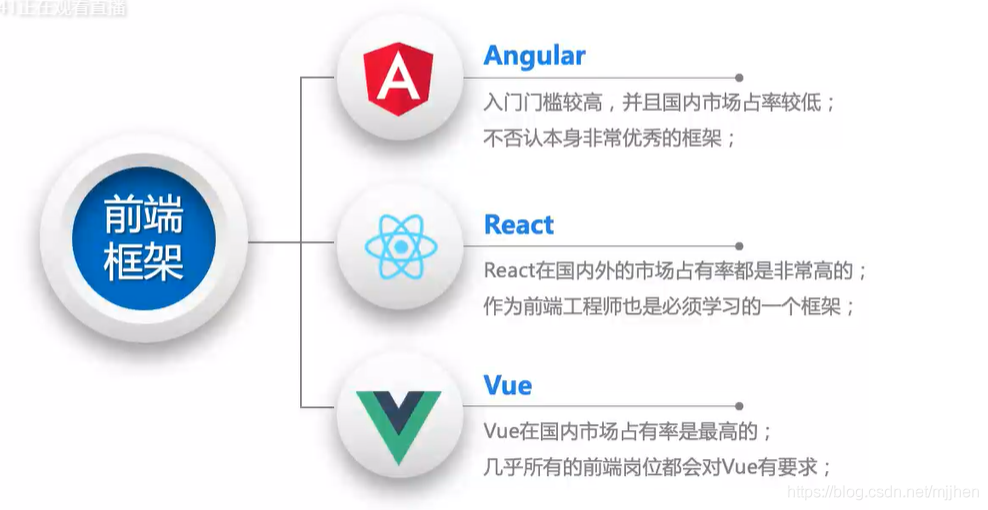
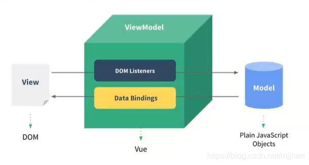
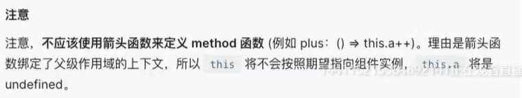
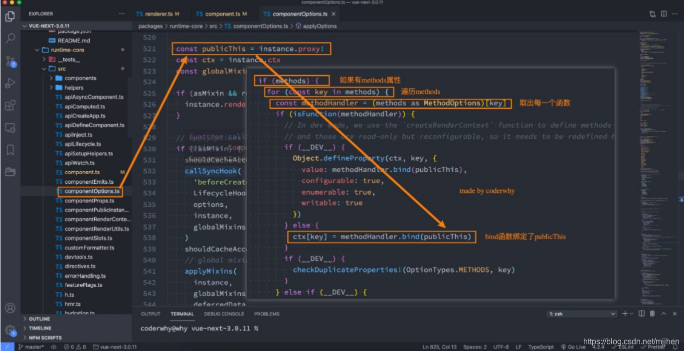

# Vue3.0+Typescript

# 深入Vue3+TypeScropt技术栈

- 1. #  深入Vue3+TypeScropt技术栈

     ## 邂逅Vue3开发

     ### 认识Vue

     - vue同view

     - 渐进式：把vue作为你应用的一部分嵌入其总

     - 目前Vue在前端处在什么地位？

       - 目前前端最主流的三大框架：Vue、React、Angular

         

         

         

     ### 如何引入Vue

     1. CDN引入

        - CDN 称之为内容分发网络( Content Delivery Network或 Content Distribution Network,缩写:CDN)

          - 它是指通过相互连接的网络系统,利用最靠近每个用户的服务器;
          - 更快、更可靠地将音乐、图片、视频、应用程序及其他文件发送给用户;
          - 来提供高性能、可扩展性及低成本的网络内容传递给用户;

        - 代码：

          ```html
          <body>
            <div id="app"></div>
          
            <script src="https://unpkg.com/vue@next"></script>
            <script>
              const mjjh = {
                template: '<h2>Hellow World</h2>'
              }
              const app = Vue.createApp(mjjh);
              app.mount("#app")
            </script>
          </body>
          ```

     2. local引入

        - 下载后直接引入

        - 代码：

          ```html
          <body>
            <div id="app"></div>
          
            <script src="../js//Vue.js"></script>
            <script>
              const app = Vue.createApp({
                template: '<h2>Hellow World</h2>'
              }).mount("#app")
            </script>
          </body>
          ```

     ### Vue初识-计数器案例

     - js原生

       ```html
       <body>
         <h2 class="counter"></h2>
         <button class="increment">+1</button>
         <button class="decrement">-1</button>
         <script>
           const conterEl = document.querySelector('.counter')
           const incrementEl = document.querySelector('.increment')
           const decrementEl = document.querySelector('.decrement')
       
           let counter = 100;
           conterEl.innerHTML = counter;
       
           incrementEl.addEventListener("click",() =>{
             counter += 1;
             conterEl.innerHTML = counter
           })
           decrementEl.addEventListener("click",() =>{
             counter -= 1;
             conterEl.innerHTML = counter
           })
       
         </script>
       </body>
       ```

     - Vue

       ```html
       <body>
         <div id="app"></div>
         <script src="../js//Vue.js"></script>
         <script>
           Vue.createApp({
             template: `
             <div>
               <h2>{{message}}</h2>
               <h2>{{counter}}</h2>
               <button @click='increment'>+1</button>
               <button @click='decrement'>-1</button>
             </div>
             `,
             data: function(){
               return{
                 message:"Hello World",
                 counter: 100
               }
             },
             methods: {
               increment(){
                 this.counter++
               },
               decrement(){
                 this.counter--
               }
             }
           }).mount("#app")
         </script>
       </body>
       ```

     ### 声明式编程和命令式编程

     - 原生开发和Vue开发的模式和特点,我们会发现是完全不同的,这里其实涉及到两种不同的编程范式命令式编程和声明式编程
     - 命令式编程关注的是“ how to do”,声明式编程关注的是" what to do",由框架(机器)完成"how"的过程

     ### MVVM模型

     - MVC和MVVM都是一种软件的体系结构
       - MVC是 Model-View-Controller的简称,是在前期被使用非常框架的架构模式,比如iS、前端
       - MVVM是 Model-View- ViewMode的简称,是目前非常流行的架构模式
     - 通常情况下,我们也经常称vue是一个MWVM的框架

     vue官方其实有说明,ue虽然并没有完全遵守MVVM的模型,但是整个设计是受到它的启发的

     

     

     ### template属性

     - 在使用 createApp的时候,我们传入了一个对象,接下来我们详细解析一下之前传入的属性分别代表什么含义。

     - template属性:表示的是Vue需要帮助我们渲染的模板信息

       - 目前我们看到它里面有很多的HTML标签,这些标签会替换掉我们挂载到的元素(比如id为app的dⅳv)的innerHTML
       - 模板中有一些奇怪的语法,比如{},比如@ )click,这些都是模板特有的语法,我们会在后面讲到

     - 但是这个模板的写法有点过于别扭了,并且IDE很有可能没有任何提示,阻碍我们编程的效率

     - vue提供了两种方式:

       - 方式一:使用 script标签,并且标记它的类型为 X-template;

         ```html
         <body>
           <div id="app">hhhh</div>
         
           <script type="x-template" id="why">
             <div>
               <h2>{{message}}</h2>
               <h2>{{counter}}</h2>
               <button @click='increment'>+1</button>
               <button @click='decrement'>-1</button>
             </div>
           </script>
         
           <script src="../js//Vue.js"></script>
           <script>
             Vue.createApp({
               template: '#why',
               data: function(){
                 return{
                   message:"Hello World",
                   counter: 100
                 }
               },
               methods: {
                 increment(){
                   this.counter++
                 },
                 decrement(){
                   this.counter--
                 }
               }
             }).mount("#app")
           </script>
         </body>
         ```

       - 方式二:使用任意标签(通常使用 template标签,因为不会被浏览器渲染),设置id;v template元素是一种用于保存客户端内容的机制,该内容再加载页面时不会被呈现,但随后可以在运行时使用 JavaScript实例化

         ```
         <body>
           <div id="app"></div>
           <template id="why">
             <div>
               <h2>{{message}}</h2>
               <h2>{{counter}}</h2>
               <button @click='increment'>+1</button>
               <button @click='decrement'>-1</button>
             </div>
           </template>
         
           <script src="../js//Vue.js"></script>
           <script>
             Vue.createApp({
               template: '#why',
               data: function(){
                 return{
                   message:"Hello World",
                   counter: 100
                 }
               },
               methods: {
                 increment(){
                   this.counter++
                 },
                 decrement(){
                   this.counter--
                 }
               }
             }).mount("#app")
           </script>
         </body>
         ```

         - 没用的小知识：也可使用div等盒子，但是div会被浏览器加载，所以会显示两个

     ### data属性

     - data属性是传入一个函数,并且该函数需要返回一个对象
       - 在Vue2x的时候,也可以传入一个对象(虽然官方推荐是一个函数);
       - **在Vue3x的时候,必须传入一个函数,否则就会直接在浏览器中报错**
     - data中返回的对象会被vue的响应式系统劫持,之后对该对象的修改或者访问都会在劫持中被处理
       - 所以我们在 template中通过{ counter}访问 counter,可以从对象中获取到数据
       - 所以我们修改 counter的值时, template中的{ counter)也会发生改变;

     ### methods属性

     - methods属性是一个对象,通常我们会在这个对象中定义很多的方法

       - 这些方法可以被绑定到 template模板中;
       - 在该方法中,我们可以使用this关键字来直接访问到data中返回的对象的属性;

     - 问题：官方文档有这个描述，即不能使用箭头函数

       

     - **为什么不能使用箭头函数(VUE3.0)？**

       - 我们在methods中要使用data返回对象中的数据：
         - 那么这个this是必须有值的，并且应该可以通过this获取到data返回对象中的数据。
       - 那么我们这个this能不能是window呢？
         - 不可以是window，因为window中我们无法获取到data返回对象中的数据；
         - 但是如果我们使用箭头函数，那么这个this就会是window了；
       - 为什么是window呢？
         - 这里涉及到箭头函数使用this的查找规则，它会在自己的上层作用于中来查找this；
         - 最终刚好找到的是script作用于中的this，所以就是window；
       - this到底是如何查找和绑定的呢？
         - https://mp.weixin.qq.com/s/hYm0JgBI25grNG_2sCRlTA

     - **不使用箭头函数的情况下，this到底指向什么**

       - 事实上Vue的源码当中就是对methods中的所有函数进行了遍历，并且通过bind绑定了this

         

     ### 如何阅读Vue源码

     - 需要的环境 npm，yarn
     - 操作步骤
       1. 安装yarn npm install yarn -g
       2. 在项目中配置yarn yarn install
       3. 在package.json中的dev后加上--sourcemap
       4. 打包项目 yarn dev （在vue/dist文件夹下有两个文件，vue.global.js和vue.global.js.map）
       5. 在vue/examplex新建自己的文件夹以及测试demo
       6. 在demo中打下断点—**debugger**
       7. 在浏览器中打开调试面板，选择其中的source面板，查看执行对应的源码